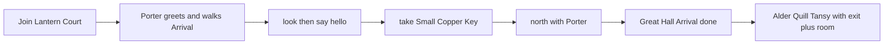

# Design Sprint DS-playtest-followup: Arrival guide after playtest

## Status

Approved and implemented locally (slices 1–4). Classroom playtest verification
is still outstanding.

Owner: Philip Bird.

Related backlog: [DS-002](README.md) (typed status, no HUD), [ADR-0029](../adr/0029-authored-npc-adventures.md)
(talk is one static string; trees were deferred).

## Release Target

Classroom follow-up after the 11 Sep 2026 playtest. Ship as four small slices,
not one mega-PR.

## Owner

Philip Bird.

## 1. Observed Problem

New Collegians did not understand what the Collegium is for, could not finish
Arrival, and could not recover when they were lost. The first key felt like a
hidden object on the ground. `take` failed in several ordinary ways. Later
quests named rooms without naming the exit word. There was no typed way to
reprint the room or see health, location, and what was in hand. Combat had no
equipment or species fit. Staff speech was a single paragraph, not a choice.

## 2. Evidence

Classroom submissions from 11 Sep 2026 (themes only; no legal names, logins,
or invite tokens in this file):

- Lost / unclear where to go after the first rooms.
- Failed `take` (bare `take`, wrong room, misspellings such as “Cooper keys”).
- Unclear quests: destination named, exit word missing.
- Request for stats (health, location, held item) as typed output, not a HUD.
- Students asked for a map; the owner deferred graphics.

Current engine facts that explain those failures:

- Arrival auto-starts. Porter’s intro is `introNarration` in
  `packages/content/quests/arrival-at-the-collegium.json`. It tells students
  `take key` and that the key is **on the stones**.
- Take matching is a **substring** of the item name (`matchItems` in
  `packages/game-engine/src/items.ts`). `take key` should already work against
  “Small Copper Key”; playtest still failed because students typed `take` alone,
  stood in the wrong room, or used the wrong words.
- Items have `category` (`key` | `book` | `ordinary`) but no type/primitive and
  no “which one” prompt that lists full command forms. Ambiguity today is
  `Which did you mean: {names}?`.
- `talk` is one static `dialogue` string (`packages/game-engine/src/talk.ts`).
- No `where`, `place`, `stats`, or `equip`. Species in
  `packages/content/character-creation/species.json` is cosmetic. Combat is the
  Practice Dummy in South Orchard with Instructor Flint.
- `look` lists exit **directions** only, not destination room titles
  (`packages/game-engine/src/look.ts`).
- The Arrival key is a per-Collegian starter (`starterPerCharacter: true` on
  `packages/content/placements/item-copper-key-lantern-court.json`). Keep that.

## 3. User Story

As a new Collegian, I need Porter to hold the first key, walk Arrival with me,
and name the exact typed command so that I learn how the school works before I
wander.

As a Collegian on an early quest, I need each objective to name the exit word
and the destination room, plus `where` / `place` and `stats`, so that I can
recover without a map.

As a Collegian in the South Orchard, I need training weapons, a typed equip,
a species fit, and numbered talk choices so that practice combat feels like a
lesson, not a bare `attack dummy`.

## 4. Hypothesis

We believe an exact Arrival hand-off, a Porter walk-with, one extra exit+room
sentence on early quests, thin `where`/`place`/`stats` commands, and a first
equipment + talk-tree slice will raise Arrival completion and reduce “I am
lost / take failed / I have no stats” reports in the next classroom playtest,
without adding a HUD, minimap, or 3D view.

## 5. Constraints

- Typed commands stay canonical. Keyboard-only. Classic mode remains complete.
- No graphical map, minimap, 3D, or PvP.
- Server authority. No game rules in React.
- No student legal names, logins, or tokens in Git, fixtures, or process logs.
- Do not log spoken text in process logs (existing classroom chat ADR).
- `say` without a live conversation stays room speech.
- Keep per-Collegian Arrival keys so thirty students do not empty one pile.
- Modest numeric combat deltas only. This is not a second combat system.
- Do not start DS-001 (semantic colour) from this sprint.
- Overlap with DS-002: `stats` is typed transcript output, not a persistent HUD.
- Porter walk-with is Arrival-only. No world-wide follower after Arrival completes.

## 6. Proposed Design

### 6.1 Arrival key in Porter’s hand; typed take; item types

Remove the ground-stone key story. Porter **holds** the Small Copper Key until
the Collegian types `take Small Copper Key` (case-insensitive; extra spaces
allowed). `take`, `take key`, `get key`, and wrong words **do not** give the
key. Porter speaks a short hint that names the exact command.

Keep `starterPerCharacter` so each Collegian has their own key.

Add an item **type/primitive**. Reuse or extend `category` to
`key` | `book` | `weapon` | `ordinary`. Every visible item name must include
that word (Small Copper Key, Practice Sword).

Matching rules outside Arrival’s special hand-off:

- If `take key` (or `take weapon`, and so on) matches **one** type-unique
  visible item, allow it.
- If **more than one** of that type is visible, reject with a prompt that
  lists full command forms, for example:
  `Which key? Type take Small Copper Key or take …`
- Use the same pattern for `drop` and `examine`.

Arrival remains the exception: even a unique `key` type match is refused until
the full name is typed.

Likely files: item schema and JSON, `packages/game-engine/src/take.ts`, Arrival
intro text, starter placement (key attached to Porter / not “on stones”),
take + Arrival tests.

### 6.2 Better intro: the Collegium’s point; Porter walks Arrival

Rewrite Porter’s first speech so the first guided minute answers *why this
game exists*:

- The Collegium is a **school**.
- Woodland students learn here to face real dangers in the Greenwood.
- Typed commands are how you learn.
- This is where animals are trained.

**Walk-with (engine, Arrival only):** while Arrival is active, Porter is a
guide companion for that Collegian — visible in their current room, and when
they `north` he walks with them in narration. He stops guiding when Arrival
completes. No world-wide follower after that.

Guided beats stay: `look` → `say hello` → exact take → `north` to Great Hall.
Porter prompts the next beat if they stall.

Out of scope: Porter following later quests, or a second tutorial character.

### 6.3 Early quest hints: exit word + destination room

On Arrival plus the three investigation quests
(`the-missing-pages.json`, `a-little-room-to-grow.json`, `the-bell-below.json`),
every objective **label** and reminder gets one extra sentence that names the
**exit word + destination room title**. Example:
`Type north to reach the Great Hall.`

Do not add a graphical map.

Existing labels already name rooms (“west of Library Stacks”). This slice adds
the typed exit word as an explicit sentence, not a new map surface.

### 6.4 `where` / `place`

New command aliases `where` and `place`: reprint the **current room title +
long description** (same truth as `look`; no extra exits required beyond what
`look` already has). Add both to the help catalog
(`packages/game-engine/src/help-catalog.ts`).

Implementation: a thin wrapper around `look`, or a dedicated notice that
reuses look text. Tests: alias parse + output contains the room title.

### 6.5 `stats`

New `stats` command (help topic): **health** (current/max), **location** (room
title), **held item** (equipped weapon name, or “nothing in hand” / first
carried item until equip ships in slice 4).

This is the playtest “show my stats” request. It overlaps DS-002; keep it
**typed**, no HUD.

Character state today has optional `health` / `maxHealth` and no
`equippedItemId` or species field on the live engine character. Slice 3 can
print health and room immediately; held item may be inventory-first until
slice 4 adds `equippedItemId`.

### 6.6 Training weapons, equip, species fit, talk trees

**Equipment (South Orchard / Flint)**

- Add a small set of **weapon** items in the training room so type
  disambiguation is real: at least Practice Sword, Practice Staff, and one
  more (Practice Sling).
- Flint **asks which weapon to try**.
- `take Practice Sword` (and the other full names) **equips** it and prints a
  one-line feel:
  - Fit: *The sword feels right in your hand.*
  - Misfit: *The staff feels unwieldy.*
- Character gains `equippedItemId`. Attack uses a small damage **buff or
  debuff** from species × weapon type.
- If the weapon is a poor fit, Flint comments and offers to **talk** (opens
  the tree).

**Species proficiencies**

Each species in `species.json` gets one `weaponProficiency`. Modest classroom
delta only: **+1** damage on a fit, **−1** on a misfit, no change if somehow
unequipped. Suggested table:

| Species   | Proficiency | Feels right with   |
|-----------|-------------|--------------------|
| Mouse     | sling       | Practice Sling     |
| Hare      | sword       | Practice Sword     |
| Badger    | staff       | Practice Staff     |
| Otter     | staff       | Practice Staff     |
| Squirrel  | sling       | Practice Sling     |
| Mole      | staff       | Practice Staff     |
| Hedgehog  | staff       | Practice Staff     |
| Fox       | sword       | Practice Sword     |
| Stoat     | sword       | Practice Sword     |
| Owl       | sling       | Practice Sling     |
| Toad      | staff       | Practice Staff     |

**Conversation trees**

New authored dialogue nodes. While a conversation is open with that NPC,
replies are `say 1` / `say 2` / `say 3` and `say yes` / `say no`.

First trees:

- **Porter** — Arrival / “what is this school”.
- **Flint** — weapon fit.

Other staff stay single-string until a later pass. `say` without a live
conversation stays room speech.

## 7. Alternatives Considered

- Keep `take key` as the Arrival success path: rejected. Playtest showed
  substring matching was not enough; the owner wants the full name as the
  lesson, with a Porter hint on every miss.
- One shared key on the stones: rejected. Per-Collegian starters already
  exist so a class cannot empty one pile.
- Graphical minimap (DS-006) or HUD status (DS-002 as a panel): rejected for
  this pass. Owner deferred the map; stats stay typed.
- World-wide Porter follower: rejected. Walk-with ends when Arrival completes.
- Full dialogue engine for every NPC: rejected. Only Porter and Flint get
  trees in slice 4. ADR-0029 remains true for Quill, Tansy, Alder, Fen.
- Starting DS-001 semantic colour in the same pass: rejected. Colour is a
  separate UI sprint.

## 8. Scope

Four implementation slices, in this order:

### Slice 1 — Item types + Arrival exact take + Porter hint + key-in-hand

- Extend item `category` with `weapon`; require the type word in the visible
  name.
- Type-unique take/drop/examine; multi-match lists full `take {Full Name}`
  forms.
- Arrival refuses anything except `take Small Copper Key`; Porter hints.
- Key is held by Porter, not described as lying on the stones.
- Keep per-Collegian key instances.

### Slice 2 — Intro copy + Porter walks Arrival

- Rewrite Arrival `introNarration` / reminder / Porter look text for school
  purpose and Greenwood danger.
- Arrival-only guide companion: Porter visible in the Collegian’s current
  room; `north` narration includes the walk; guiding stops on completion.
- Stall prompts for the next unfinished Arrival beat.

### Slice 3 — Quest hint sentences + `where` / `place` + `stats`

- Extra exit-word + room-title sentence on Arrival and the three
  investigation quests (labels and reminders).
- `where` and `place` aliases; help catalog.
- `stats`: health, location, held item (inventory fallback until slice 4).

### Slice 4 — Training weapons, equip, species table, Flint/Porter trees

- Three training weapons in South Orchard; Flint asks which to try.
- `equippedItemId`; take-to-equip feel lines; +1 / −1 species fit.
- Poor-fit opens Flint’s talk tree.
- Porter and Flint conversation nodes with `say 1|2|3` and `say yes|no`.

## 9. Non-Scope

- DS-001 semantic colour and message categories.
- Graphical map, minimap, 3D room renderer, combat frame, bag/equipment panel.
- PvP. Attacking other Collegians.
- Porter following later quests. A second tutorial NPC.
- Talk trees for Quill, Tansy, Alder, Fen, or other staff.
- Logging speech text in process logs.
- Student identities or tokens in the repository.
- A second combat system, weapon skills beyond one proficiency, or large
  damage numbers.
- Changing published quest IDs without an explicit progress migration
  (ADR-0029).

## 10. Data and Event Changes

Slice 1:

- Item schema: `category` includes `weapon` (or a sibling `type` field if
  extending `category` proves cleaner). Names must contain the type word.
- Arrival intro/reminder copy. Placement story: key on Porter, not stones.
- Take/drop/examine failure messages gain full-command disambiguation.

Slice 2:

- Arrival-only companion flag or equivalent per-character guide state.
- Move narration may mention Porter while Arrival is active.
- Look/presence must show Porter in the Collegian’s current room during
  Arrival without moving the shared room fixture for everyone else (per-viewer
  companion, not a second global NPC instance that leaves Lantern Court empty).

Slice 3:

- Command parse aliases: `where`, `place`, `stats`.
- Help catalog entries.
- Quest JSON labels and reminder sentences. Keep objective **ids** stable.

Slice 4:

- New item templates: Practice Sword, Practice Staff, Practice Sling.
- `species.json`: `weaponProficiency` per species.
- Character: `equippedItemId`; persist it with existing character records.
- Species available on the live character (today it is creation-only / cosmetic).
- Dialogue node JSON for Porter and Flint; open-conversation state per
  character (which NPC, which node).
- `say 1` / `say 2` / `say 3` / `say yes` / `say no` parse only while a
  conversation is open; otherwise `say` remains room speech.
- Attack resolution reads equipped weapon × species for a ±1 damage adjust.

No new runtime dependency. Prefer content JSON + existing persistence
patterns. If a migration is required for `equippedItemId` or conversation
state, keep it additive.

## 11. Accessibility Review

- All new information is typed text in the existing transcript. No colour-only
  meaning, no motion requirement, no extra click target.
- Command words stay in help. Exact Arrival command is spoken by Porter on
  every failed take.
- Keyboard-only. Focus remains on the command line.
- Screen-reader users get the same narration as everyone else.
- Do not rely on a HUD or map for location, health, or the next room.

## 12. Acceptance Criteria

Slice 1

- Arrival does not grant the key for `take`, `take key`, or `get key`.
- `take Small Copper Key` (any case, extra spaces) grants that Collegian’s key.
- Failed Arrival take prints a Porter hint that names `take Small Copper Key`.
- Intro no longer says the key is on the stones.
- Two visible items of the same type produce `Which {type}? Type take …`.
- One type-unique match outside Arrival still succeeds (`take key` if only
  one key is visible).
- Thirty concurrent Collegians still each have a key; one take does not steal
  another’s.

Slice 2

- First Porter speech states that the Collegium is a school, the Greenwood has
  real dangers, and this is where animals are trained.
- During Arrival, the acting Collegian sees Porter in their current room.
- `north` during Arrival includes walk-with narration.
- After Arrival completes, Porter no longer follows.
- Other Collegians still see the courtyard Porter; walk-with is not a stolen
  global fixture.

Slice 3

- Arrival and the three investigation quests name an exit word and a
  destination room title on each relevant objective/reminder.
- `where` and `place` reprint the current room title and long description.
- `help` lists `where` / `place` / `stats`.
- `stats` prints health current/max, room title, and held item (or “nothing
  in hand”).

Slice 4

- South Orchard has at least three named weapons whose names include `Sword`,
  `Staff`, and `Sling` (or the chosen third type word).
- Taking a training weapon equips it and prints a fit or misfit line.
- Attack damage shifts by +1 or −1 from the species table.
- A misfit prompts talk; `talk flint` opens a tree; `say 1` / `say yes` (etc.)
  advance that tree.
- `talk porter` during or after Arrival can open the school-purpose tree.
- `say hello` with no open tree remains room speech and still counts for
  Arrival’s speak objective.

## 13. Test Plan

- Unit: Arrival exact-take rejects substring forms; hint names the full
  command; type disambiguation lists full forms; `where`/`place` parse;
  `stats` contains title and health; walk-with present only while Arrival is
  active; equip feel lines; ±1 damage; `say 1` ignored as tree input when no
  conversation is open.
- Content: item names contain their type word; species table covers every
  species id; quest objective ids unchanged.
- Contract: any new event fields stay optional or versioned; classic segments
  still match narration.
- Integration / socket: Arrival take and Flint take persist; conversation
  state survives reconnect if persisted.
- Manual classroom: one teacher account, fictional students only; finish
  Arrival with the exact command; walk north with Porter; type `where` and
  `stats`; try two weapons in the orchard.

Do not put real student speech or identities in fixtures.

## 14. Implementation Summary

All four slices are in the engine and bundled content. Arrival requires
`take Small Copper Key`. Porter walks with the Collegian until Arrival
completes. `where` / `place` reprint look. `stats` prints health, room, and
held item. South Orchard has three training weapons with species fit and
Porter/Flint talk trees. Synthetic Collegian tests cover the walkthrough.

## 15. Before-and-After Evidence

Not started. After a slice ships, record typed transcript excerpts from a
fictional walkthrough (Arrival take miss → hint → exact take; `where`;
`stats`; one weapon fit and one misfit).

## 16. Outcome

Not yet measured. Hypothesis check is the next classroom playtest: fewer lost
/ failed-take reports, and students can state what the Collegium is for after
Arrival.

## 17. Reflection

Write after the named slice is verified. Likely follow-ups if the hypothesis
holds: talk trees for Quill / Tansy / Alder; DS-002 HUD only if typed `stats`
is not enough; DS-006 map only if exit+room sentences still leave students
lost.
